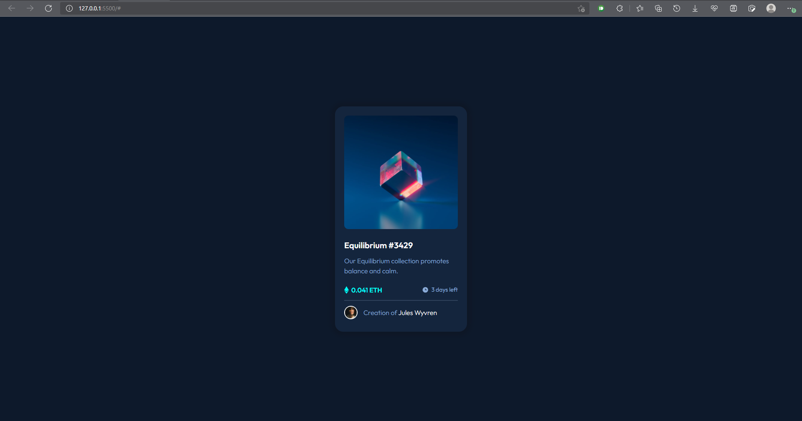
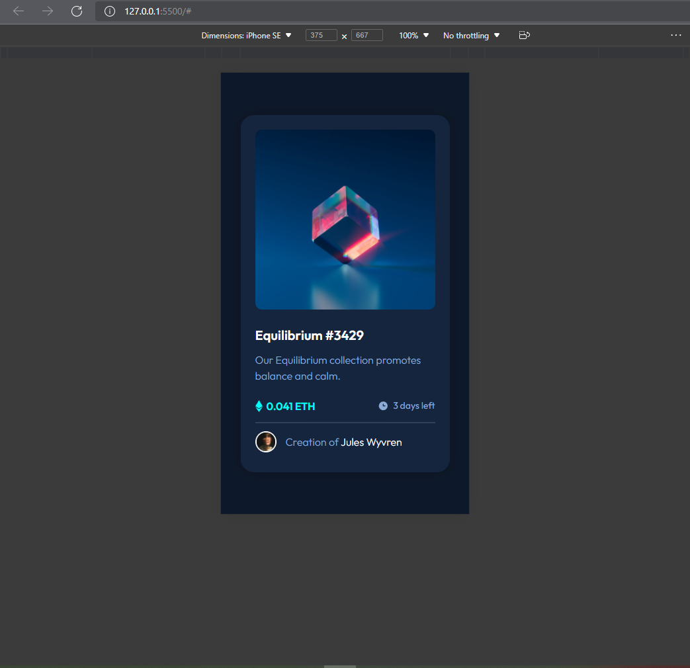

# Frontend Mentor - NFT preview card component solution
This is a solution to the [NFT preview card component challenge on Frontend Mentor](https://www.frontendmentor.io/challenges/nft-preview-card-component-SbdUL_w0U). Frontend Mentor challenges help you improve your coding skills by building realistic projects.

## Table of contents

- [Overview](#overview)
  - [The challenge](#the-challenge)
  - [Screenshot](#screenshot)
  - [Links](#links)
- [My process](#my-process)
  - [Built with](#built-with)
  - [What I learned](#what-i-learned)
  - [Continued development](#continued-development)
  - [Useful resources](#useful-resources)
- [Author](#author)
- [Acknowledgments](#acknowledgments)

## Overview
# build out this preview card component and get it looking as close to the design as possible.
Users should be able to:

- View the optimal layout depending on their device's screen size
- See hover states for interactive elements
### Screenshots

### Links
- Solution URL: [Solution](https://crizalid12.github.io/NFT-preview-card-component/)
- Live Site URL: [Demo](https://github.com/crizalid12/NFT-preview-card-component)

### My process
- Recreated the card in Figma
- Started with markup (HTML)
- Add CSS

### Built with
- Flexbox
- General CSS

### What I learned

- pseudo elements (:hover, ::after) (I knew before but i renforced my understanding)

### Continued development
- I must focus on layouts and responsive design.
- Next to achieve CSS Grid.

## Author

- Website - [Boutarfa Riyadh](https://riad.me)
- Frontend Mentor - [@Crizalid](https://www.frontendmentor.io/profile/crizalid12)
- Twitter - [@Boutarfa_Riyadh](https://twitter.com/Boutarfa_Riyadh)

## Acknowledgments
- I tried to achieve the same exact hover image (icon view), but i couldn't with plain CSS, i didn't want to solve it with Javascript.
- if you have a solution please be comfortable to add it.